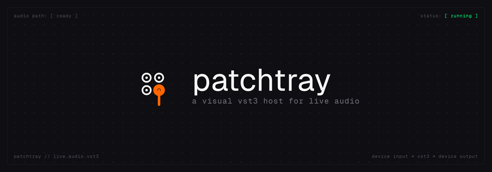
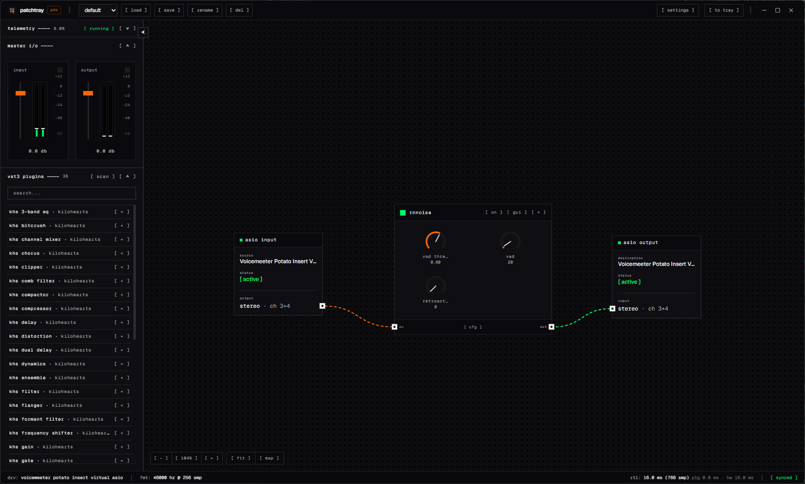
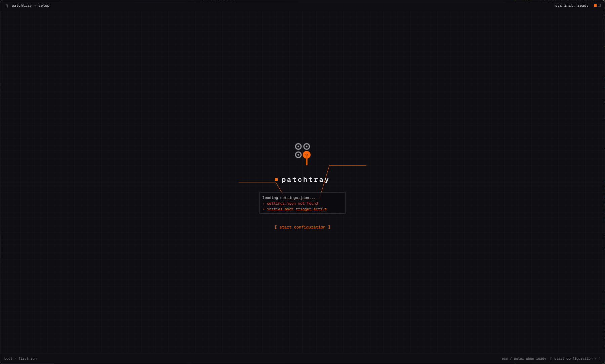
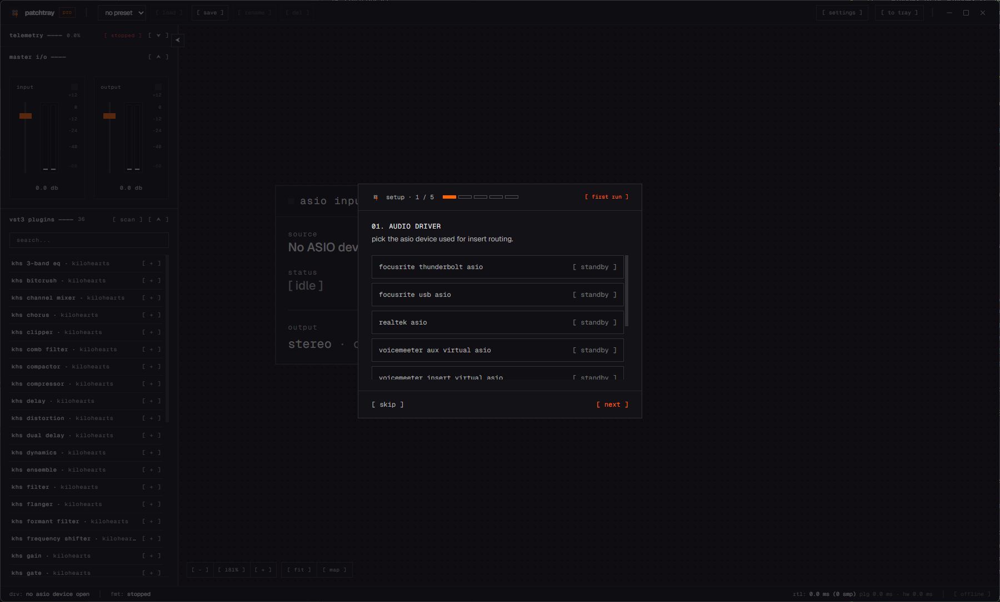
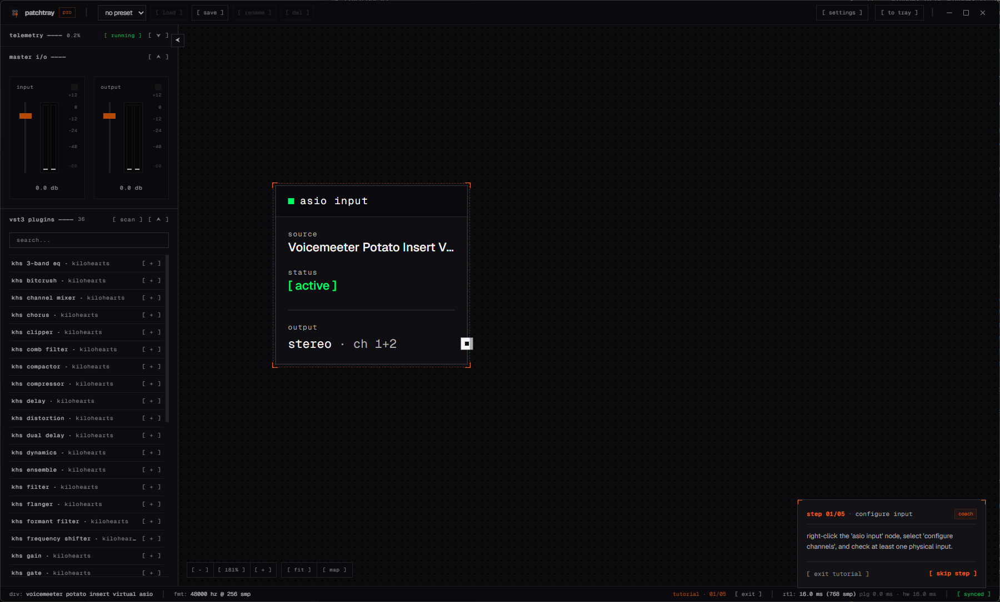
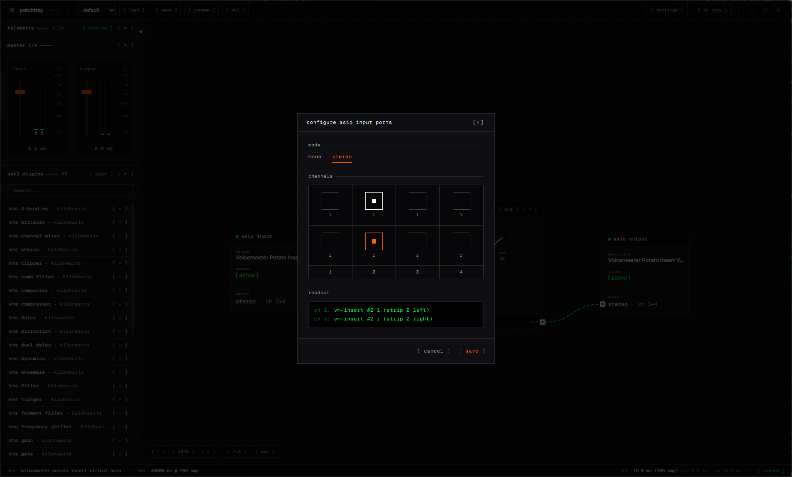
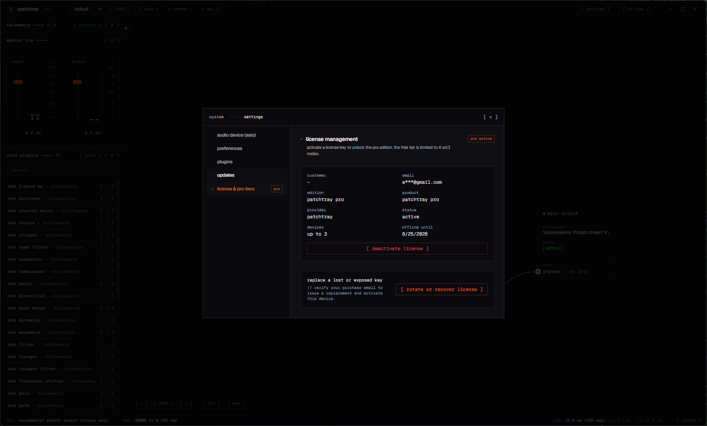

  

  <a href="https://patchtray.io"><strong>Website</strong></a>
  ·
  <a href="https://github.com/PatchTray/PatchTray/releases/latest"><strong>Download</strong></a>
  ·
  <a href="https://patchtray.io/guide"><strong>Guide</strong></a>
  ·
  <a href="https://patchtray.io/support"><strong>Support</strong></a>

  
  
  

# PatchTray

PatchTray is a visual VST3 host for live audio. Connect a compatible duplex audio device, place your plugins on the graph, route the processed signal back to selected device channels, and keep the chain running from the system tray. VoiceMeeter Patch Inserts provide an expanded multichannel workflow but are not required.

This is PatchTray's public release and community repository. The application source and service infrastructure are maintained privately; this repository contains downloadable builds, updater metadata, approved media assets, and public issue tracking.

## What it does

- Routes live audio through a visual device input → VST3 → device output graph.
- Hosts VST3 effects with native plugin editors and on-node parameter controls.
- Shows master meters, graph state, and real-time processing telemetry.
- Saves reusable presets and keeps processing while minimized to the tray.
- Includes a Free tier with up to 4 VST3 nodes and 1 preset.
- Offers PatchTray Pro with unlimited nodes and presets.

  

<strong>More product screenshots</strong>

### First launch

### Guided audio-device setup

### Interactive routing tutorial

### Device-channel configuration

### License management and recovery

## Download

Download the newest Windows installer from [Releases](https://github.com/PatchTray/PatchTray/releases/latest).

Each release provides:

- `PatchTray_<version>_x64_en-US.msi` — the Windows installer;
- `PatchTray_<version>_x64_en-US.msi.sig` — the Tauri updater signature;
- `SHA256SUMS.txt` — checksums for release assets; and
- `latest.json` — metadata used by PatchTray's automatic updater.

PatchTray is currently distributed as an unsigned public beta. Windows may display an **Unknown Publisher** or SmartScreen warning. Only download builds from this repository or [patchtray.io](https://patchtray.io).

## Requirements

- Windows 10 or Windows 11, 64-bit;
- a compatible duplex device exposed through ASIO, Windows Audio, or DirectSound; and
- one or more 64-bit VST3 plugins for processing.

VoiceMeeter Patch Inserts are supported when a larger multichannel routing surface is useful, but PatchTray can also work directly with compatible hardware and virtual audio devices.

## Issues and feature requests

Use the repository's issue forms to report a reproducible bug or propose an improvement:

- [Report a bug](https://github.com/PatchTray/PatchTray/issues/new?template=bug_report.yml)
- [Request a feature](https://github.com/PatchTray/PatchTray/issues/new?template=feature_request.yml)

Before posting, check for an existing issue and read [CONTRIBUTING.md](CONTRIBUTING.md). Never include a license key, recovery code, payment information, purchase email, raw device identifier, or another person's private data in a public issue.

For purchase, licensing, privacy, or account-specific help, use [private support](https://patchtray.io/support) instead of GitHub Issues. Security reports should follow [SECURITY.md](SECURITY.md).

## Brand and media assets

Approved logos, application captures, and marketing artwork live in [`assets/`](assets/). See the [asset usage notes](assets/README.md) before publishing or modifying them.

## Links

- [PatchTray website](https://patchtray.io)
- [Download the latest release](https://github.com/PatchTray/PatchTray/releases/latest)
- [Getting started guide](https://patchtray.io/guide)
- [Refund policy](https://patchtray.io/refunds)
- [Privacy policy](https://patchtray.io/privacy)
- [Terms](https://patchtray.io/terms)

© 2026 CyR1en. PatchTray and its brand assets are provided under the terms described in [`assets/README.md`](assets/README.md).
